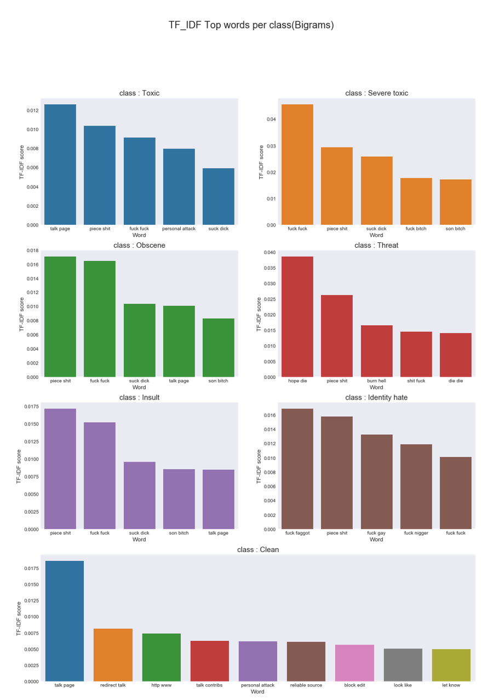

# Toxic_Text_Classification

The kernel is great for getting in-depth info about the text data. By working on this I got a hold on understanding the approach and tuning data for problem solving.

## The Data
Discussing things you care about can be difficult. The threat of abuse and harassment online means that many people stop expressing themselves and give up on seeking different opinions. Platforms struggle to effectively facilitate conversations, leading many communities to limit or completely shut down user comments.

The Conversation AI team, a research initiative founded by Jigsaw and Google (both a part of Alphabet) are working on tools to help improve online conversation. One area of focus is the study of negative online behaviors, like toxic comments (i.e. comments that are rude, disrespectful or otherwise likely to make someone leave a discussion). So far they’ve built a range of publicly available models served through the Perspective API, including toxicity. But the current models still make errors, and they don’t allow users to select which types of toxicity they’re interested in finding (e.g. some platforms may be fine with profanity, but not with other types of toxic content).

In this competition, you’re challenged to build a multi-headed model that’s capable of detecting different types of of toxicity like threats, obscenity, insults, and identity-based hate better than Perspective’s current models. You’ll be using a dataset of comments from Wikipedia’s talk page edits. Improvements to the current model will hopefully help online discussion become more productive and respectful.

The data consists large number of Wikipedia comments which have been labeled by human raters for toxic behavior. The types of toxicity are:

    • toxic    
    • severe_toxic
    • obscene
    • threat
    • insult
    • identity_hate
    
This git approaches by visualizing the data, creating features, applying different models mainly: Logistic regression, Naive Bayes, LDA.

**Introduction**

Being anonymous over the internet can sometimes make people say nasty
things that they normally would not in real life. Let\'s filter out the
hate from our platforms one comment at a time.

**Objective:**

To create an EDA/ feature-engineering starter notebook for toxic comment
classification.

**Data Overview:**

The dataset here is from wiki corpus dataset which was rated by human
raters for toxicity. The corpus contains 63M comments from discussions
relating to user pages and articles dating from 2004-2015.

Different platforms/sites can have different standards for their toxic
screening process. Hence the comments are tagged in the following five
categories

The tagging was done via **crowdsourcing** which means that the dataset
was rated by different people and the tagging might not be 100% accurate
too. The same concern is being
discussed [[here]{.underline}](https://www.kaggle.com/c/jigsaw-toxic-comment-classification-challenge/discussion/46131).

The [[source
paper]{.underline}](https://arxiv.org/pdf/1610.08914.pdf) also contains
more interesting details about the dataset creation.

Note: 
------

A [New test
dataset](https://www.kaggle.com/c/jigsaw-toxic-comment-classification-challenge/discussion/46177) is
being created by the organizers as the test set labels are
present [here](https://figshare.com/articles/Wikipedia_Talk_Labels_Toxicity/4563973).

The kernal has been updated for the new data.

**Analysis:**

There are a greater number of clean messages than abusive so it must be
class imbalance.

Total comments = 159571

Total clean comments = 143346

Total tags = 35098

{width="4.8199650043744535in"
height="2.5721926946631672in"}

-   The toxicity is not evenly spread out across classes. Hence we might
    face class imbalance problems

-   There are \~95k comments in the training dataset and there are \~21
    k tags and \~86k clean comments!?

    -   This is only possible when multiple tags are associated with
        each comment (eg) a comment can be classified as both toxic and
        obscene.

{width="4.486630577427822in"
height="2.394307742782152in"}

The above plot shows the number of multiple tags present for each row.
It can be concluded that there are even rows which have been tagged into
6 categories.

{width="3.201421697287839in"
height="2.7379680664916886in"}

Only \~10% of the total comments have some sort of toxicity in them.
There are certain comments(31) that are marked as all of the above!

Which tags go together?
-----------------------

Now let\'s have a look at how often the tags occur together. A good
indicator of that would be a correlation plot.

{width="4.609625984251968in"
height="1.202146762904637in"}

The above table represents the Crosstab/ confusion matrix of Toxic
comments with the other classes.

Some interesting observations:

-   A Severe toxic comment is always toxic

-   Other classes seem to be a subset of toxic barring a few exceptions

More about cramers test can be studied
at [[https://en.wikipedia.org/wiki/Cram%C3%A9r%27s\_V]{.underline}](https://en.wikipedia.org/wiki/Cram%C3%A9r%27s_V)

{width="5.095833333333333in"
height="0.8708333333333333in"}

{width="5.4847222222222225in"
height="3.9298611111111112in"}

That was a whole lot of toxicity. Some weird observations:

-   Some of the comments are extremely and mere copy paste of the same
    thing

-   Comments can still contain IP addresses(eg:62.158.73.165),
    usernames(eg:ARKJEDI10) and some mystery numbers(i assume is
    article-IDs)

Wordclouds - Frequent words:
============================

Now, let\'s take a look at words that are associated with these classes.

Chart Desc: The visuals here are word clouds (ie) more frequent words
appear bigger. A cool way to create word clouds with funky pics is
given in\_this\_link. It involves the following steps.

-   Search for an image and its base 64 encoding

-   Paste encoding in a cell and convert it using codecs package to
    image

-   Create word cloud with the new image as a mask

A simpler way would be to create a new kaggle dataset and import images
from there.

{width="2.5488353018372703in"
height="3.085561023622047in"}

{width="4.606181102362204in"
height="4.529411636045494in"}

Feature engineering:
====================

I\'ve broadly classified my feature engineering ideas into the following
three groups

Direct features:
----------------

Features which are a directly due to words/content.We would be exploring
the following techniques

-   Word frequency features

    -   Count features

    -   Bigrams

    -   Trigrams

-   Vector distance mapping of words (Eg: Word2Vec)

-   Sentiment scores

Indirect features:
------------------

Some more experimental features.

-   count of sentences

-   count of words

-   count of unique words

-   count of letters

-   count of punctuations

-   count of uppercase words/letters

-   count of stop words

-   Avg length of each word

Long sentences or more words do not seem to be a significant indicator
of toxicity.

Chart desc: Violin plot is an alternative to the traditional box plot.
The inner markings show the percentiles while the width of the
\"violin\" shows the volume of comments at that level/instance.

### **Word count VS unique word count:**

There are noticeable shifts in the mean of both word count and unique
word count across clean and toxic comments.

-   Chart desc: The first chart is a split violin chart. It is a
    variation of the traditional box chart/violin chart which allows us
    to split the violin in the middle based on a categorical variable.

### Unique word count percent:

There is a bulge near the 0-10% mark which indicates a large number of
toxic comments which contain very little variety of words.

-   Chart desc: The second chart is an overlay of two kernel density
    estimation plots of percentage of unique words out of all the words
    in the comment, done for both clean and toxic comments

Even though the number of clean comments dominates the dataset(\~90%),
there are only 75 clean comments that are spam, which makes it a
powerful indicator of a toxic comment.

Spammers are more toxic!
========================

Direct features:
================

1)Count based features(for unigrams):
-------------------------------------

Lets create some features based on frequency distribution of the words.
Initially lets consider taking words one at a time (ie) Unigrams

Python\'s SKlearn provides 3 ways of creating count features.All three
of them first create a vocabulary(dictionary) of words and then create
a [sparse
matrix](http://localhost:8889/notebooks/Toxic_Text_Classification/Toxic_text_classification.ipynb#https://en.wikipedia.org/wiki/Sparse_matrix) of
word counts for the words in the sentence that are present in the
dictionary. A brief description of them:

-   CountVectorizer

    -   Creates a matrix with frequency counts of each word in the text
        corpus

-   TF-IDF Vectorizer

    -   TF - Term Frequency \-- Count of the words(Terms) in the text
        corpus (same of Count Vect)

    -   IDF - Inverse Document Frequency \-- Penalizes words that are
        too frequent. We can think of this as regularization

-   HashingVectorizer

    -   Creates a hashmap(word to number mapping based on hashing
        technique) instead of a dictionary for vocabulary

    -   This enables it to be more scalable and faster for larger text
        coprus

    -   Can be parallelized across multiple threads

Using TF-IDF here. Note: Using the concatenated dataframe \"merge\"
which contains both text from train and test dataset to ensure that the
vocabulary that we create does not missout on the words that are unique
to testset

References:
https://www.kaggle.com/jagangupta/stop-the-s-toxic-comments-eda
https://www.kaggle.com/c/jigsaw-toxic-comment-classification-challenge/data
